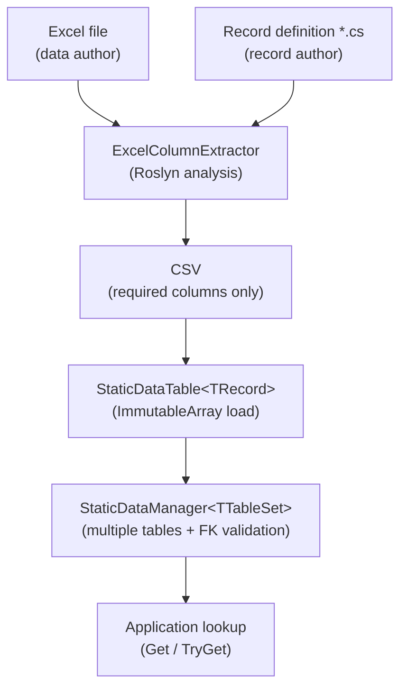

# 1. Introduction

## Introducing Sdp

**StaticDataPipeline (Sdp)** is a pipeline library that loads static data defined in Excel into C# Records and places validated, immutable collections in memory for fast lookups.

It is well suited to data that is "loaded once and only read afterward," such as in game servers, clients, and simulation tools.

   

## Key Benefits

#### Parallelizing Excel work and code work
From the moment the data structure is agreed upon, the data author and the record author can proceed independently without waiting for each other.

 

#### Declarative schema definition
Types, columns, and foreign key relationships are declared directly with C# Records and Attributes. The data loads into strongly typed objects through declarations alone, with no separate mapping code.

 

#### Up-front validation
Checks such as foreign key integrity, null representation handling, and missing required Attributes are performed automatically at the build stage and the load stage. This reduces the chance of bad data flowing through to production.

 

#### Type branding support
With single-parameter records or enums, IDs that mean different things can be treated as distinct types. Incorrect ID assignments surface at the build stage, while the Excel sheet still shows them as an ordinary single column (see [5.3](./05-advanced/03-type-branding.md) for details).

 

#### Guaranteed immutability of loaded data
Records are immutable, and collections are also stored in immutable types such as `ImmutableArray`, `FrozenSet`, and `FrozenDictionary`. The very path by which data could be unintentionally changed after loading is closed off.

   

## Data Flow

   

## If You Just Want to Run It Once

The fastest path is to follow the [Quick Start](./quickstart.md) page through to the end. It covers only the skeleton — Record → Table → Manager → load → query — and leaves out FKs and views, so it takes about five minutes. For real usage, follow along from [3.1](./03-usage/01-record-to-excel.md) afterward.

---

[Table of Contents](./README.md) | [Next: 2. Installation →](./02-installation.md)
