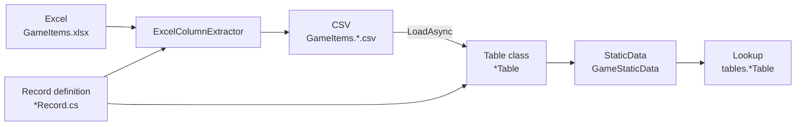

# Quick Start

This single page covers the most basic flow of Sdp — **define a Record → define a Table → load with a Manager → query**. It does not cover FKs or views (see the [detailed usage guide](./README.md) for each topic).

After following this document to the end, you will have:

- A StaticDataManager instance that loaded multiple sheets at once
- An index for looking up a single row by ID
- A skeleton you can grow as additional sheets are added

This assumes you have completed installation by following [2. Installation](./02-installation.md).

## Overall Flow



`ExcelColumnExtractor` takes both the Record and the Excel file as input and extracts a CSV, and that CSV is loaded into tables through the StaticDataManager's `LoadAsync`. Lookups start from the StaticDataManager's `Current` snapshot.

</br></br></br>

## 1. Define a Record

Describe the shape of a row and which sheet it comes from using a record + Attributes.

```csharp
using Sdp.Attributes;

public enum ItemCategory
{
    Consumable,
    Weapon,
    Armor,
}

[StaticDataRecord("GameItems", "Items")]
public sealed record ItemRecord(
    int Id,
    string Name,
    [Range(0, 1_000_000)] int Price,
    ItemCategory Category);

[StaticDataRecord("GameItems", "Heroes")]
public sealed record HeroRecord(
    int Id,
    string Name,
    int Level);

[StaticDataRecord("GameItems", "Quests")]
public sealed record QuestRecord(
    int Id,
    [RegularExpression(@"^.{1,50}$")] string Title,
    int RewardItemId);
```

- `[StaticDataRecord("file", "sheet")]` — the first argument is the Excel file name (without extension), and the second is the sheet name. The file and sheet names may differ. The extracted CSV follows the `{file}.{sheet}.csv` convention, becoming `GameItems.Items.csv`.
- The parameter name is the header name. Enums are matched as strings.
- `[Range(0, 1_000_000)]` — checks that the `Price` value is within the range 0 to 1,000,000. Simply declaring it makes the value automatically validated at both the extraction stage and runtime loading, so out-of-range values are filtered out with no extra code.
- `[RegularExpression(@"^.{1,50}$")]` — checks via regular expression that `Title` is between 1 and 50 characters. This too is validated at both extraction and loading by declaration alone.

</br></br></br>

## 2. Define a Table

Inherit from `StaticDataTable<TRecord>` and provide a constructor that takes a single `ImmutableArray<TRecord>`. Also add a `UniqueIndex` so you can find a single record by key.

```csharp
using System.Collections.Immutable;
using Sdp.Table;

public sealed class ItemTable : StaticDataTable<ItemRecord>
{
    private readonly UniqueIndex<ItemRecord, int> byId;

    public ItemTable(ImmutableArray<ItemRecord> records)
        : base(records)
    {
        byId = new UniqueIndex<ItemRecord, int>(records, x => x.Id);
    }

    public ItemRecord Get(int id) => byId.Get(id);

    public bool TryGet(int id, out ItemRecord? record) => byId.TryGet(id, out record);
}

public sealed class HeroTable(ImmutableArray<HeroRecord> records)
    : StaticDataTable<HeroRecord>(records);

public sealed class QuestTable(ImmutableArray<QuestRecord> records)
    : StaticDataTable<QuestRecord>(records);
```

Not only tables that have a `UniqueIndex` like `ItemTable`, but also index-free tables like `HeroTable` and `QuestTable`, expose the full list directly through the `Records` property. `Records` preserves the row order entered in the CSV.

</br></br></br>

## 3. Manager and TableSet

The Manager receives "which tables it handles" as a TableSet record. Each parameter of the TableSet is an instance of a table class.

```csharp
using Microsoft.Extensions.Logging;
using Sdp.Manager;

public sealed class GameStaticData(ILogger<GameStaticData> logger)
    : StaticDataManager<GameStaticData.TableSet>(logger)
{
    public sealed record TableSet(
        ItemTable? ItemTable,
        HeroTable? HeroTable,
        QuestTable? QuestTable);
}
```

- Each table in the TableSet is nullable. This is because load options can skip some of them ([3.5](./03-usage/05-static-data-manager.md)).
- **Expose to the outside through `Current` only.** At the call site, take `staticData.Current` once and pull each table out of it. The reason the StaticDataManager does not unwrap tables like `ItemTable => Current.ItemTable!` is that two `Current.X` accesses within the same operation could see different snapshots. Taking it once pins that snapshot for the rest of the operation.

</br></br></br>

## 4. Prepare the CSV

Place per-sheet CSVs such as `GameItems.Items.csv` in the CSV directory (in practice, the Excel → CSV step is automated through the [3.1](./03-usage/01-record-to-excel.md) and [3.2](./03-usage/02-header-generator.md) flow).

```
Id,Name,Price,Category
1,Potion,100,Consumable
2,Sword,5000,Weapon
3,Shield,4000,Armor
```

</br></br></br>

## 5. Load and Query

```csharp
var staticData = new GameStaticData(logger);
await staticData.LoadAsync("./csv");

var tables = staticData.Current;
var sword = tables.ItemTable!.Get(2);
Console.WriteLine($"{sword.Name}: {sword.Price}");
```

`LoadAsync` takes the entire CSV directory, loads all tables of the TableSet in parallel, and — if there are FKs — finishes validation before swapping `Current` all at once. Calling it again performs an atomic swap to a new snapshot. Concurrent lookups are safe.

```csharp
// If LoadAsync may run in the background, take Current into a variable before use
var tables = staticData.Current;
foreach (var quest in tables.QuestTable!.Records)
{
    Console.WriteLine($"{quest.Id} {quest.Title}");
}
```

</br></br></br>

## Next Steps

The five steps you learned here are 80% of using Sdp. It is natural to continue with one of the next two chapters.

- If you already have an Excel sheet and need to write Records to match it — [3.1 Working with Excel](./03-usage/01-record-to-excel.md)
- If you are starting from scratch and need to write everything from the Record to the Excel — [3.3 Defining Your First Record](./03-usage/03-first-record.md)

---

[Table of Contents](./README.md)
