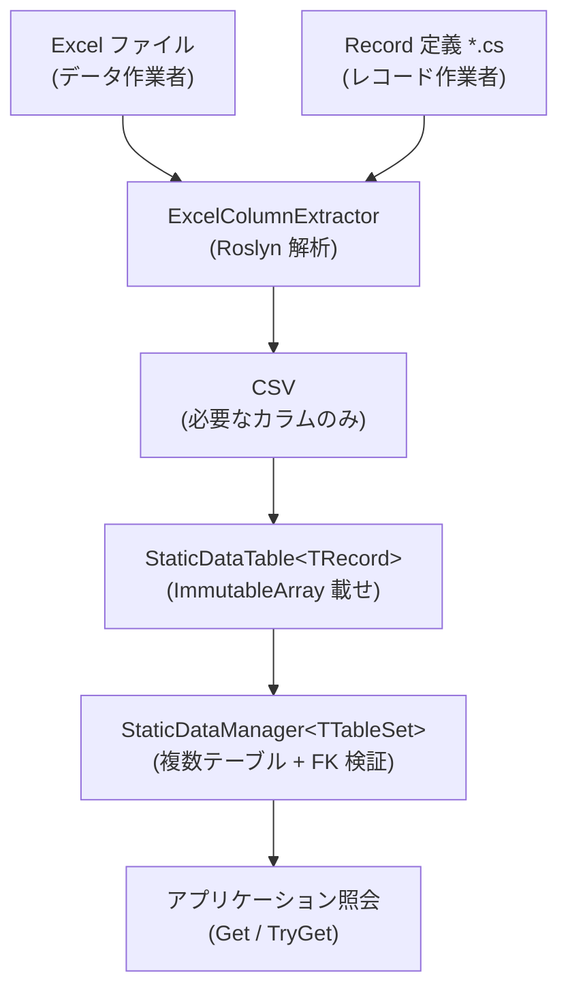

# 1. 紹介

## Sdp の紹介

**StaticDataPipeline (Sdp)** は、Excel に定義された静的データを C# Record にロードし、検証済みの状態の不変コレクションをメモリに載せて高速に照会できるようにするパイプラインライブラリです。

ゲームサーバーやクライアント、シミュレーションツールのように「一度ロードしておいて読むだけ」のデータに適しています。

   

## 主な利点

#### Excel 作業とコード作業の並列化
データ構造が合意された時点から、データ作業者とレコード作業者が互いを待たずに独立して進められます。

 

#### 宣言的なスキーマ定義
型、カラム、外部キー関係を C# Record と Attribute で直接宣言します。別途のマッピングコードなしに、宣言だけで強い型のオブジェクトにロードされます。

 

#### 事前バリデーション
外部キー整合性、null 表現の処理、必須 Attribute の欠落といった検査を、ビルド段階とロード段階で自動的に行います。不正なデータが運用環境まで流れてしまうことを減らせます。

 

#### タイプブランディングのサポート
単一パラメーターの record や enum で、意味の異なる ID 同士を別個の型として扱えます。誤った ID の代入はビルド段階で表面化し、Excel シートでは普通の 1 カラムとして見えます（詳細は [5.3](./05-advanced/03-type-branding.md)）。

 

#### ロード済みデータの不変性保証
Record が不変であり、コレクションも `ImmutableArray`、`FrozenSet`、`FrozenDictionary` のような不変型に載せられます。ロード後にデータが意図せず変わる経路そのものがふさがれています。

   

## データフロー

   

## とりあえず一度動かしてみたいなら

最も速い道は [クイックスタート](./quickstart.md) の 1 ページを最後まで追ってみることです。Record → Table → Manager → ロード → 照会までの骨格だけを扱い、FK とビューは抜いてあるので 5 分で終わります。本格的な利用はその後に [3.1](./03-usage/01-record-to-excel.md) から追っていけば十分です。

---

[目次](./README.md) | [次へ: 2. インストール →](./02-installation.md)
