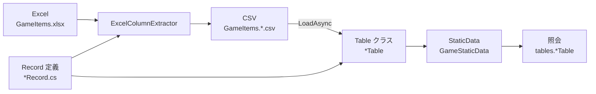

# クイックスタート

Sdp の最も基本的な流れ — **Record の定義 → Table の定義 → Manager でロード → 照会** — を 1 ページで完結させます。FK とビューは扱いません（各項目は [詳細な使い方](./README.md) を参照）。

このドキュメントを最後まで進めると、次のものが揃います。

- 複数シートを一度に読み込んだ StaticDataManager インスタンス
- ID で 1 行を照会できるインデックス
- シートが増えたら拡張していける骨格

インストールは [2. インストール](./02-installation.md) に従って済ませてあることを前提とします。

## 全体の流れ



`ExcelColumnExtractor` が Record と Excel の両方を入力として受け取り CSV を抽出し、その CSV が StaticDataManager の `LoadAsync` を通じてテーブルへ読み込まれます。照会は StaticDataManager の `Current` スナップショットから始まります。

</br></br></br>

## 1. Record の定義

1 行の形と、それがどのシートから来るのかを record + Attribute で記述します。

```csharp
using Sdp.Attributes;

public enum ItemCategory
{
    Consumable,
    Weapon,
    Armor,
}

[StaticDataRecord("GameItems", "Items")]
public sealed record ItemRecord(
    int Id,
    string Name,
    [Range(0, 1_000_000)] int Price,
    ItemCategory Category);

[StaticDataRecord("GameItems", "Heroes")]
public sealed record HeroRecord(
    int Id,
    string Name,
    int Level);

[StaticDataRecord("GameItems", "Quests")]
public sealed record QuestRecord(
    int Id,
    [RegularExpression(@"^.{1,50}$")] string Title,
    int RewardItemId);
```

- `[StaticDataRecord("ファイル", "シート")]` — 第 1 引数は Excel ファイル名（拡張子を除く）、第 2 引数はシート名です。ファイル名とシート名は異なっていても構いません。抽出された CSV は `{ファイル}.{シート}.csv` という規則に従い、`GameItems.Items.csv` になります。
- パラメーター名がそのままヘッダー名になります。enum は文字列としてマッチングされます。
- `[Range(0, 1_000_000)]` — `Price` の値が 0 ～ 1,000,000 の範囲内かを検査します。宣言しておくだけで抽出段階とランタイムロードの両方で自動的に検証され、範囲外の値は別途コードを書かずに弾かれます。
- `[RegularExpression(@"^.{1,50}$")]` — `Title` が 1 ～ 50 文字かを正規表現で検査します。これも宣言だけで抽出とロードの両方で検証されます。

</br></br></br>

## 2. Table の定義

`StaticDataTable<TRecord>` を継承し、`ImmutableArray<TRecord>` 1 個を受け取るコンストラクターを提供します。キーで単一レコードを見つけられるよう `UniqueIndex` も一緒に置きます。

```csharp
using System.Collections.Immutable;
using Sdp.Table;

public sealed class ItemTable : StaticDataTable<ItemRecord>
{
    private readonly UniqueIndex<ItemRecord, int> byId;

    public ItemTable(ImmutableArray<ItemRecord> records)
        : base(records)
    {
        byId = new UniqueIndex<ItemRecord, int>(records, x => x.Id);
    }

    public ItemRecord Get(int id) => byId.Get(id);

    public bool TryGet(int id, out ItemRecord? record) => byId.TryGet(id, out record);
}

public sealed class HeroTable(ImmutableArray<HeroRecord> records)
    : StaticDataTable<HeroRecord>(records);

public sealed class QuestTable(ImmutableArray<QuestRecord> records)
    : StaticDataTable<QuestRecord>(records);
```

`ItemTable` のように `UniqueIndex` を置いたテーブルだけでなく、`HeroTable`・`QuestTable` のようなインデックスのないテーブルも `Records` プロパティで全リストをそのまま公開します。`Records` は CSV に入力された行の順序を保持します。

</br></br></br>

## 3. Manager と TableSet

Manager は「どのテーブルを扱うのか」を TableSet record として受け取ります。TableSet の各パラメーターはテーブルクラスのインスタンスです。

```csharp
using Microsoft.Extensions.Logging;
using Sdp.Manager;

public sealed class GameStaticData(ILogger<GameStaticData> logger)
    : StaticDataManager<GameStaticData.TableSet>(logger)
{
    public sealed record TableSet(
        ItemTable? ItemTable,
        HeroTable? HeroTable,
        QuestTable? QuestTable);
}
```

- TableSet の各テーブルは nullable です。ロードオプションで一部をスキップできるためです（[3.5](./03-usage/05-static-data-manager.md)）。
- **外部への公開は `Current` 1 か所だけにします。** 呼び出し側では `staticData.Current` で一度受け取っておき、その中から各テーブルを取り出して使います。StaticDataManager で `ItemTable => Current.ItemTable!` のようにテーブルを展開しておかない理由は、同じ処理の中で 2 回の `Current.X` がそれぞれ異なるスナップショットを見てしまう可能性があるためです。一度受け取っておけば、そのスナップショットが処理の最後まで固定されます。

</br></br></br>

## 4. CSV の準備

`GameItems.Items.csv` などシートごとの CSV を CSV ディレクトリに置きます（実際には [3.1](./03-usage/01-record-to-excel.md)、[3.2](./03-usage/02-header-generator.md) の流れで Excel → CSV が自動化されます）。

```
Id,Name,Price,Category
1,Potion,100,Consumable
2,Sword,5000,Weapon
3,Shield,4000,Armor
```

</br></br></br>

## 5. ロードと照会

```csharp
var staticData = new GameStaticData(logger);
await staticData.LoadAsync("./csv");

var tables = staticData.Current;
var sword = tables.ItemTable!.Get(2);
Console.WriteLine($"{sword.Name}: {sword.Price}");
```

`LoadAsync` は CSV ディレクトリを丸ごと受け取り、TableSet のすべてのテーブルを並列ロードし、FK があれば検証まで終えてから `Current` を一度に差し替えます。再度呼び出すと新しいスナップショットへ atomic swap されます。同時照会は安全です。

```csharp
// LoadAsync がバックグラウンドで実行されうる環境なら Current を変数に受け取ってから使う
var tables = staticData.Current;
foreach (var quest in tables.QuestTable!.Records)
{
    Console.WriteLine($"{quest.Id} {quest.Title}");
}
```

</br></br></br>

## 次のステップ

ここで身につけた 5 ステップが Sdp 利用の 80 % です。次の 2 章のどちらかへ進むと自然です。

- すでに Excel シートがあり、それに合わせて Record を書く必要があるなら — [3.1 Excel を扱う](./03-usage/01-record-to-excel.md)
- 空の状態から Record を起点に Excel まで書く必要があるなら — [3.3 最初の Record を定義する](./03-usage/03-first-record.md)

---

[目次](./README.md)
