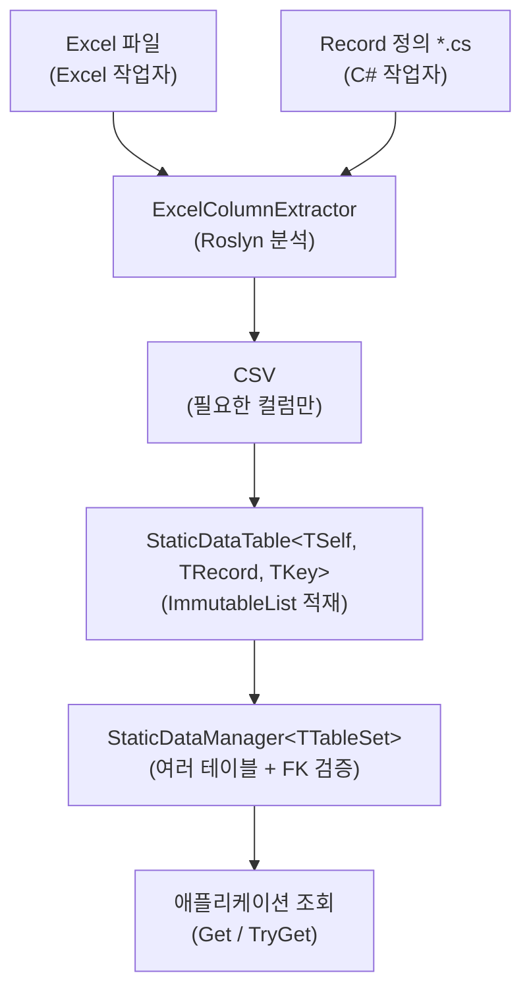

# 1. 소개

## Sdp란

**StaticDataPipeline (Sdp)** 은 Excel에서 정의된 정적 데이터를 C# 레코드로 옮기고, 검증된 상태의 불변 컬렉션을 메모리에 올려 빠르게 조회하도록 도와주는 파이프라인 라이브러리입니다.

게임 서버와 클라이언트, 시뮬레이션 도구 등 "한 번 로드해 두고 읽기만 하는" 성격의 데이터에 적합합니다.

## 해결하려는 문제

정적 데이터를 운영할 때 반복적으로 부딪히는 세 가지 문제가 있습니다.

1. **Excel과 코드의 불일치** — 기획자가 컬럼을 추가·삭제하거나 이름을 바꾸면 C# 쪽에서 런타임에야 문제가 드러납니다.
2. **로드 후 변형** — 공유 싱글톤으로 쓰이는 데이터가 어디선가 수정되어 재현 불가능한 버그를 낳습니다.
3. **서버·클라이언트·기획 간 작업 격리** — 같은 Excel을 여러 리포지토리에서 소비할 때 누군가는 컬럼 일부만 필요합니다.

Sdp는 이 세 가지를 각각 다음과 같이 해결합니다.

- **정적 분석**으로 Excel 추출 이전에 대부분의 오류를 잡는다.
- **불변 컬렉션** (`ImmutableList`, `FrozenDictionary`) 으로 데이터를 저장해 로드 후 변경을 막는다.
- **Record 기반 컬럼 추출** (`ExcelColumnExtractor`) 으로 각 소비자가 필요한 컬럼만 CSV로 뽑아 쓴다.

## 설계 철학

- **불변성**: 로드된 데이터는 절대 변경되지 않는다.
- **조기 검증**: 가능한 가장 이른 시점(정적 분석 → CSV 추출 → 로드)에 오류가 드러나도록 한다.
- **작업자 격리**: Excel 작업자와 C# 작업자가 서로 다른 리포지토리에서 독립적으로 진행해도 접점이 깨지지 않도록 한다.

## 데이터 흐름

## 구성 요소

|구성요소|역할|배포 형태|
|-|-|-|
|`Sdp`|런타임 라이브러리 — 테이블·매니저·CSV 로더·Attribute|NuGet (예정)|
|`SchemaInfoScanner`|Roslyn 기반 Record 스키마 분석|내부 라이브러리|
|`ExcelColumnExtractor`|Record 스키마에 맞춰 Excel에서 CSV 추출|CLI|
|`StaticDataHeaderGenerator`|Record로부터 표준 Excel 헤더 생성|CLI|

## 이 문서에서 사용하는 예제

이 문서의 모든 예제는 "**아이템 상점**" 이라는 작은 도메인을 공유합니다. 두 개의 세트를 번갈아 사용합니다.

- **세트 A** — `Item` 단일 테이블. 3.1 \~ 3.4의 기초 예제에 등장.
- **세트 B** — `Item` + `ItemCategory` 두 테이블. FK와 복잡한 타입, StaticDataManager 사용 예제(3.5 이후)에 등장.

---

[목차](./README.md) | [다음: 2. 설치 →](./02-installation.md)
