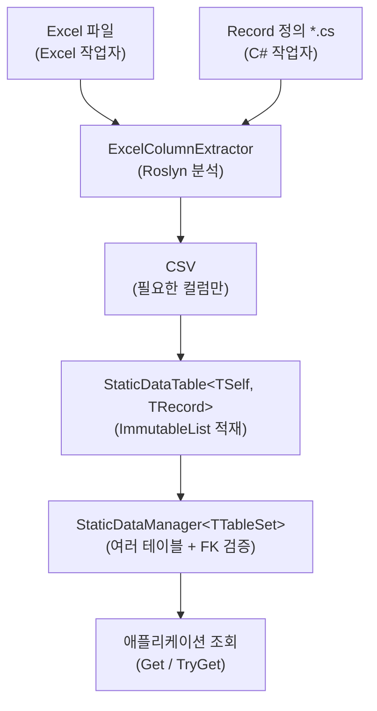

# 1. 소개

## Sdp란

**StaticDataPipeline (Sdp)** 은 Excel에서 정의된 정적 데이터를 C# 레코드로 옮기고, 검증된 상태의 불변 컬렉션을 메모리에 올려 빠르게 조회하도록 도와주는 파이프라인 라이브러리입니다.

게임 서버와 클라이언트, 시뮬레이션 도구 등 "한 번 로드해 두고 읽기만 하는" 성격의 데이터에 적합합니다.

## 해결하려는 문제

정적 데이터를 운영할 때 반복적으로 부딪히는 세 가지 문제가 있습니다.

1. **Excel과 코드의 불일치** — 기획자가 컬럼을 추가·삭제하거나 이름을 바꾸면 C# 쪽에서 런타임에야 문제가 드러납니다.
2. **로드 후 변형** — 공유 싱글톤으로 쓰이는 데이터가 어디선가 수정되어 재현 불가능한 버그를 낳습니다.
3. **서버·클라이언트·기획 간 작업 격리** — 같은 Excel을 여러 리포지토리에서 소비할 때 누군가는 컬럼 일부만 필요합니다.

Sdp는 이 세 가지를 각각 다음과 같이 해결합니다.

- **정적 분석**으로 Excel 추출 이전에 대부분의 오류를 잡는다.
- **불변 컬렉션** (`ImmutableList`, `FrozenDictionary`) 으로 데이터를 저장해 로드 후 변경을 막는다.
- **Record 기반 컬럼 추출** (`ExcelColumnExtractor`) 으로 각 소비자가 필요한 컬럼만 CSV로 뽑아 쓴다.

## 다른 라이브러리 대비 장점

흔히 쓰이는 정적 데이터 솔루션 (직접 Excel 파싱, Code Generator 기반 도구) 과 비교했을 때 Sdp 가 가지는 차별점은 다음과 같습니다.

- **Roslyn 정적 분석으로 빌드 시점 검증** — Record 선언만 보고도 누락된 Attribute, 잘못된 FK 참조, 미지원 타입을 빌드 시점에 모두 잡아낸다. 데이터를 한 줄도 만들기 전에 스키마 결함이 드러난다.
- **Excel 컬럼-Record 컬럼 디커플링** — Excel 시트에 무관한 컬럼이 추가로 있어도 Record 가 요구하는 컬럼만 CSV 로 뽑는다. 같은 Excel을 서버·클라이언트·툴이 각자의 Record 정의로 분리 소비할 수 있다.
- **불변 컬렉션 보장** — 로드된 테이블은 `ImmutableList` / `FrozenDictionary` 위에 올라가므로 라이브러리 사용자가 의도하지 않게 데이터를 수정할 수 없다.
- **Record 우선 / Excel 우선 양방향 지원** — Excel이 먼저 만들어진 경우와 Record 가 먼저 확정된 경우 모두를 1급 시민으로 다룬다. 후자에는 표준 헤더 자동 생성기를 제공한다.
- **FK / SwitchFK 검증 내장** — 외래 키, 조건부 외래 키 검증이 라이브러리 수준에서 지원된다. Manager 가 모든 테이블을 로드한 직후 FK 위반을 일괄 검사한다.
- **타입 브랜딩 패턴 지원** — 단일 파라미터 record 와 enum 두 가지 방식으로 ID 의 잘못된 대입을 컴파일 시점에 차단할 수 있다. CSV 헤더는 평범한 한 컬럼으로 표현되므로 Excel 작업자에게 부담을 주지 않는다 (자세한 내용은 [4.3](./04-advanced/03-type-branding.md)).

## 설계 철학

- **불변성**: 로드된 데이터는 절대 변경되지 않는다.
- **조기 검증**: 가능한 가장 이른 시점(정적 분석 → CSV 추출 → 로드)에 오류가 드러나도록 한다.
- **작업자 격리**: Excel 작업자와 C# 작업자가 서로 기다리지 않고 작업을 진행할 수 있도록 한다.

## 데이터 흐름

## 구성 요소

|구성요소|역할|
|-|-|
|`Sdp`|런타임 라이브러리 — 테이블·매니저·CSV 로더·Attribute|
|`SchemaInfoScanner`|Roslyn 기반 Record 스키마 분석|
|`ExcelColumnExtractor`|Record 스키마에 맞춰 Excel에서 CSV 추출|
|`StaticDataHeaderGenerator`|Record로부터 표준 Excel 헤더 생성|

---

[목차](./README.md) | [다음: 2. 설치 →](./02-installation.md)
