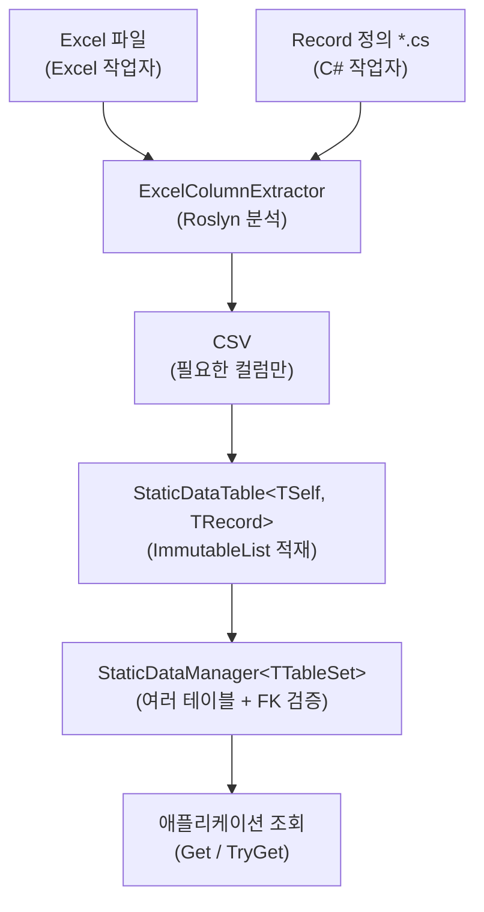

# 1. 소개

## Sdp란

**StaticDataPipeline (Sdp)** 은 Excel 에 정의된 정적 데이터를 C# Record 로 옮기고, 검증된 상태의 불변 컬렉션을 메모리에 올려 빠르게 조회하도록 도와주는 파이프라인 라이브러리입니다.

게임 서버와 클라이언트, 시뮬레이션 도구처럼 "한 번 로드해 두고 읽기만 하는" 데이터에 적합합니다.

## 주요 장점

#### Excel 작업과 코드 작업의 병렬화
데이터 구조가 합의된 시점부터 Excel 작업자와 C# 작업자가 서로를 기다리지 않고 독립적으로 진행할 수 있습니다.

#### 선언적 스키마 정의
타입, 컬럼, 외래 키 관계를 C# Record 와 Attribute 로 직접 선언합니다. 별도 매핑 코드 없이 선언만으로 강타입 객체에 로드됩니다.

#### 사전 유효성 검사
외래 키 무결성, null 표현 처리, 필수 Attribute 누락 같은 검사를 빌드 단계와 로드 단계에서 자동으로 수행합니다. 잘못된 데이터가 운영 환경까지 흘러가는 일을 줄일 수 있습니다.

#### 타입 브랜딩 지원
단일 파라미터 record 나 enum 으로 의미가 다른 ID 들을 별개 타입으로 취급할 수 있습니다. 잘못된 ID 대입은 빌드 단계에서 드러나고, Excel 시트에서는 평범한 한 컬럼으로 보입니다 (자세한 내용은 [4.3](./04-advanced/03-type-branding.md)).

#### 로드된 데이터의 불변성 보장
Record 가 불변이고 컬렉션도 `ImmutableArray`, `FrozenSet`, `FrozenDictionary` 같은 불변 타입에 적재됩니다. 로드 이후 데이터가 의도치 않게 바뀌는 경로 자체가 막혀 있습니다.

## 동작 방향

- **스키마는 코드에 있다** — Record 정의가 진실의 원본이고, Excel 은 그 스키마를 채우는 역할입니다.
- **검증은 두 시점에 나뉜다** — Record 선언 자체의 결함은 Roslyn 기반 정적 분석에서, 데이터 결함은 로드 단계에서 잡습니다. 위반이 여러 건이면 한 번에 모아 보고합니다.
- **테이블 간 참조도 같은 흐름에서 검증된다** — `[ForeignKey]` / `[SwitchForeignKey]` 선언만으로 시트 사이의 ID 참조를 함께 확인합니다.
- **같은 Excel 을 여러 소비자가 부분만 가져갈 수 있다** — Record 가 요구하는 컬럼만 추출되므로, 서버, 클라이언트, 툴이 각자 다른 Record 정의로 같은 Excel 을 소비할 수 있습니다.
- **Code-first / Excel-first 모두 받는다** — Record 가 먼저 확정된 경우에는 표준 헤더 생성기로 Excel 헤더를 뽑아 작업을 시작할 수 있고, 이미 있는 Excel 에 맞춰 Record 를 작성하는 흐름도 그대로 지원합니다.

## 데이터 흐름

## 일단 한번 돌려 보고 싶다면

가장 빠른 길은 [빠른 시작](./quickstart.md) 한 페이지를 끝까지 따라가 보는 것입니다. Record → Table → Manager → 로드 → 조회까지의 골격만 다루며, FK 와 뷰는 빠져 있어 5분이면 끝납니다. 본격적인 사용은 그 다음에 [3.1](./03-usage/01-record-to-excel.md) 부터 따라가면 됩니다.

---

[목차](./README.md) | [다음: 2. 설치 →](./02-installation.md)
