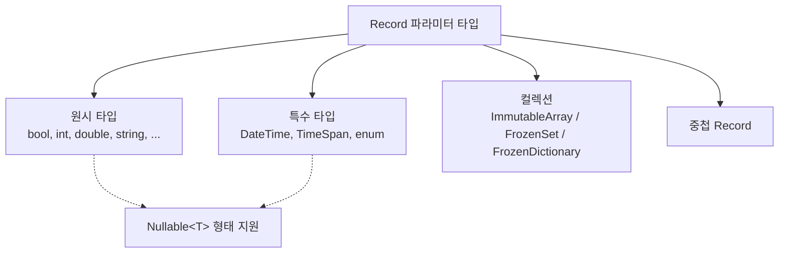

# 4.1 지원 타입 (Schemata)

Sdp 는 Record 의 파라미터 타입을 정적 분석해, 그 타입이 CSV 셀 값으로 표현 가능한지 검사합니다. 이 장은 **어떤 타입이 허용되는지**, **각 타입에 어떤 Attribute 를 붙일 수 있는지**, **어떤 Attribute 가 필수인지** 를 정리합니다.

각 Attribute 의 자세한 설명은 [4.2 Attribute 카탈로그](./02-attributes.md) 로 미루고, 여기서는 Schemata 관점에서만 다룹니다. Attribute 이름을 클릭하면 해당 항목으로 이동합니다.

## 목차

문서 등장순입니다.

- [한눈에 보기](#한눈에-보기)
- 원시 타입 — [bool](#bool), [bool?](#bool-1), [byte](#byte), [byte?](#byte-1), [sbyte](#sbyte), [sbyte?](#sbyte-1), [char](#char), [char?](#char-1), [short](#short), [short?](#short-1), [ushort](#ushort), [ushort?](#ushort-1), [int](#int), [int?](#int-1), [uint](#uint), [uint?](#uint-1), [long](#long), [long?](#long-1), [ulong](#ulong), [ulong?](#ulong-1), [float](#float), [float?](#float-1), [double](#double), [double?](#double-1), [decimal](#decimal), [decimal?](#decimal-1), [string](#string), [string?](#string-1)
- 특수 타입 — [DateTime](#datetime), [DateTime?](#datetime-1), [TimeSpan](#timespan), [TimeSpan?](#timespan-1), [enum](#enum), [enum?](#enum-1)
- 컬렉션 — [기본 타입 Array / Set](#기본-타입-array--set), [특수 타입 Array / Set](#특수-타입-array--set), [Record Array / Set](#record-array--set), [Map (FrozenDictionary)](#map-frozendictionary), [컬렉션 자체 제약](#컬렉션-자체에-대한-제약)
- [중첩 Record](#중첩-record)

## 한눈에 보기

Sdp 가 받는 타입은 네 범주입니다.



각 항목은 다음 양식으로 정리합니다.

- **파싱**: CSV 셀 값을 읽어 들이는 방식
- **필수 Attribute**: 해당 타입에 반드시 붙어 있어야 하는 Attribute
- **사용 가능한 Attribute**: 해당 타입에 의미 있게 붙일 수 있는 Attribute (필수 포함)

`[ColumnName]` 과 `[Ignore]` 은 모든 타입에 사용할 수 있으므로, 각 타입 항목의 "사용 가능한 Attribute" 에서는 이 둘을 생략합니다. 필요하면 [4.2](./02-attributes.md) 를 참고하세요.

---

## 원시 타입

### `bool`

- 파싱: `bool.TryParse` (대소문자 무시)
- 필수 Attribute: 없음
- 사용 가능한 Attribute: [`[Key]`](./02-attributes.md#attr-key), [`[ForeignKey]`](./02-attributes.md#attr-foreignkey), [`[SwitchForeignKey]`](./02-attributes.md#attr-switchforeignkey)

### `bool?`

- 파싱: 셀 값이 `[NullString]` 과 같으면 `null`, 아니면 `bool.TryParse`
- 필수 Attribute: [`[NullString]`](./02-attributes.md#attr-nullstring)
- 사용 가능한 Attribute: [`[NullString]`](./02-attributes.md#attr-nullstring)

### `byte`

- 파싱: `byte.TryParse` (InvariantCulture)
- 필수 Attribute: 없음
- 사용 가능한 Attribute: [`[Range]`](./02-attributes.md#attr-range), [`[Key]`](./02-attributes.md#attr-key), [`[ForeignKey]`](./02-attributes.md#attr-foreignkey), [`[SwitchForeignKey]`](./02-attributes.md#attr-switchforeignkey)

### `byte?`

- 파싱: 셀 값이 `[NullString]` 과 같으면 `null`, 아니면 `byte.TryParse`
- 필수 Attribute: [`[NullString]`](./02-attributes.md#attr-nullstring)
- 사용 가능한 Attribute: [`[NullString]`](./02-attributes.md#attr-nullstring), [`[Range]`](./02-attributes.md#attr-range)

### `sbyte`

- 파싱: `sbyte.TryParse` (InvariantCulture)
- 필수 Attribute: 없음
- 사용 가능한 Attribute: [`[Range]`](./02-attributes.md#attr-range), [`[Key]`](./02-attributes.md#attr-key), [`[ForeignKey]`](./02-attributes.md#attr-foreignkey), [`[SwitchForeignKey]`](./02-attributes.md#attr-switchforeignkey)

### `sbyte?`

- 파싱: 셀 값이 `[NullString]` 과 같으면 `null`, 아니면 `sbyte.TryParse`
- 필수 Attribute: [`[NullString]`](./02-attributes.md#attr-nullstring)
- 사용 가능한 Attribute: [`[NullString]`](./02-attributes.md#attr-nullstring), [`[Range]`](./02-attributes.md#attr-range)

### `char`

- 파싱: 단일 문자
- 필수 Attribute: 없음
- 사용 가능한 Attribute: [`[Key]`](./02-attributes.md#attr-key), [`[ForeignKey]`](./02-attributes.md#attr-foreignkey), [`[SwitchForeignKey]`](./02-attributes.md#attr-switchforeignkey)

### `char?`

- 파싱: 셀 값이 `[NullString]` 과 같으면 `null`, 아니면 단일 문자
- 필수 Attribute: [`[NullString]`](./02-attributes.md#attr-nullstring)
- 사용 가능한 Attribute: [`[NullString]`](./02-attributes.md#attr-nullstring)

### `short`

- 파싱: `short.TryParse` (InvariantCulture)
- 필수 Attribute: 없음
- 사용 가능한 Attribute: [`[Range]`](./02-attributes.md#attr-range), [`[Key]`](./02-attributes.md#attr-key), [`[ForeignKey]`](./02-attributes.md#attr-foreignkey), [`[SwitchForeignKey]`](./02-attributes.md#attr-switchforeignkey)

### `short?`

- 파싱: 셀 값이 `[NullString]` 과 같으면 `null`, 아니면 `short.TryParse`
- 필수 Attribute: [`[NullString]`](./02-attributes.md#attr-nullstring)
- 사용 가능한 Attribute: [`[NullString]`](./02-attributes.md#attr-nullstring), [`[Range]`](./02-attributes.md#attr-range)

### `ushort`

- 파싱: `ushort.TryParse` (InvariantCulture)
- 필수 Attribute: 없음
- 사용 가능한 Attribute: [`[Range]`](./02-attributes.md#attr-range), [`[Key]`](./02-attributes.md#attr-key), [`[ForeignKey]`](./02-attributes.md#attr-foreignkey), [`[SwitchForeignKey]`](./02-attributes.md#attr-switchforeignkey)

### `ushort?`

- 파싱: 셀 값이 `[NullString]` 과 같으면 `null`, 아니면 `ushort.TryParse`
- 필수 Attribute: [`[NullString]`](./02-attributes.md#attr-nullstring)
- 사용 가능한 Attribute: [`[NullString]`](./02-attributes.md#attr-nullstring), [`[Range]`](./02-attributes.md#attr-range)

### `int`

- 파싱: `int.TryParse` (InvariantCulture)
- 필수 Attribute: 없음
- 사용 가능한 Attribute: [`[Range]`](./02-attributes.md#attr-range), [`[Key]`](./02-attributes.md#attr-key), [`[ForeignKey]`](./02-attributes.md#attr-foreignkey), [`[SwitchForeignKey]`](./02-attributes.md#attr-switchforeignkey)

### `int?`

- 파싱: 셀 값이 `[NullString]` 과 같으면 `null`, 아니면 `int.TryParse`
- 필수 Attribute: [`[NullString]`](./02-attributes.md#attr-nullstring)
- 사용 가능한 Attribute: [`[NullString]`](./02-attributes.md#attr-nullstring), [`[Range]`](./02-attributes.md#attr-range)

### `uint`

- 파싱: `uint.TryParse` (InvariantCulture)
- 필수 Attribute: 없음
- 사용 가능한 Attribute: [`[Range]`](./02-attributes.md#attr-range), [`[Key]`](./02-attributes.md#attr-key), [`[ForeignKey]`](./02-attributes.md#attr-foreignkey), [`[SwitchForeignKey]`](./02-attributes.md#attr-switchforeignkey)

### `uint?`

- 파싱: 셀 값이 `[NullString]` 과 같으면 `null`, 아니면 `uint.TryParse`
- 필수 Attribute: [`[NullString]`](./02-attributes.md#attr-nullstring)
- 사용 가능한 Attribute: [`[NullString]`](./02-attributes.md#attr-nullstring), [`[Range]`](./02-attributes.md#attr-range)

### `long`

- 파싱: `long.TryParse` (InvariantCulture)
- 필수 Attribute: 없음
- 사용 가능한 Attribute: [`[Range]`](./02-attributes.md#attr-range), [`[Key]`](./02-attributes.md#attr-key), [`[ForeignKey]`](./02-attributes.md#attr-foreignkey), [`[SwitchForeignKey]`](./02-attributes.md#attr-switchforeignkey)

### `long?`

- 파싱: 셀 값이 `[NullString]` 과 같으면 `null`, 아니면 `long.TryParse`
- 필수 Attribute: [`[NullString]`](./02-attributes.md#attr-nullstring)
- 사용 가능한 Attribute: [`[NullString]`](./02-attributes.md#attr-nullstring), [`[Range]`](./02-attributes.md#attr-range)

### `ulong`

- 파싱: `ulong.TryParse` (InvariantCulture)
- 필수 Attribute: 없음
- 사용 가능한 Attribute: [`[Range]`](./02-attributes.md#attr-range), [`[Key]`](./02-attributes.md#attr-key), [`[ForeignKey]`](./02-attributes.md#attr-foreignkey), [`[SwitchForeignKey]`](./02-attributes.md#attr-switchforeignkey)

### `ulong?`

- 파싱: 셀 값이 `[NullString]` 과 같으면 `null`, 아니면 `ulong.TryParse`
- 필수 Attribute: [`[NullString]`](./02-attributes.md#attr-nullstring)
- 사용 가능한 Attribute: [`[NullString]`](./02-attributes.md#attr-nullstring), [`[Range]`](./02-attributes.md#attr-range)

### `float`

- 파싱: `float.TryParse` (InvariantCulture)
- 필수 Attribute: 없음
- 사용 가능한 Attribute: [`[Range]`](./02-attributes.md#attr-range)

### `float?`

- 파싱: 셀 값이 `[NullString]` 과 같으면 `null`, 아니면 `float.TryParse`
- 필수 Attribute: [`[NullString]`](./02-attributes.md#attr-nullstring)
- 사용 가능한 Attribute: [`[NullString]`](./02-attributes.md#attr-nullstring), [`[Range]`](./02-attributes.md#attr-range)

### `double`

- 파싱: `double.TryParse` (InvariantCulture)
- 필수 Attribute: 없음
- 사용 가능한 Attribute: [`[Range]`](./02-attributes.md#attr-range)

### `double?`

- 파싱: 셀 값이 `[NullString]` 과 같으면 `null`, 아니면 `double.TryParse`
- 필수 Attribute: [`[NullString]`](./02-attributes.md#attr-nullstring)
- 사용 가능한 Attribute: [`[NullString]`](./02-attributes.md#attr-nullstring), [`[Range]`](./02-attributes.md#attr-range)

### `decimal`

- 파싱: `decimal.TryParse` (InvariantCulture)
- 필수 Attribute: 없음
- 사용 가능한 Attribute: [`[Range]`](./02-attributes.md#attr-range)

### `decimal?`

- 파싱: 셀 값이 `[NullString]` 과 같으면 `null`, 아니면 `decimal.TryParse`
- 필수 Attribute: [`[NullString]`](./02-attributes.md#attr-nullstring)
- 사용 가능한 Attribute: [`[NullString]`](./02-attributes.md#attr-nullstring), [`[Range]`](./02-attributes.md#attr-range)

### `string`

- 파싱: 셀 값을 그대로 문자열로 사용
- 필수 Attribute: 없음
- 사용 가능한 Attribute: [`[RegularExpression]`](./02-attributes.md#attr-regularexpression), [`[Key]`](./02-attributes.md#attr-key), [`[ForeignKey]`](./02-attributes.md#attr-foreignkey), [`[SwitchForeignKey]`](./02-attributes.md#attr-switchforeignkey)

### `string?`

- 파싱: 셀 값이 `[NullString]` 과 같으면 `null`, 아니면 그대로 문자열
- 필수 Attribute: [`[NullString]`](./02-attributes.md#attr-nullstring)
- 사용 가능한 Attribute: [`[NullString]`](./02-attributes.md#attr-nullstring), [`[RegularExpression]`](./02-attributes.md#attr-regularexpression)

---

## 특수 타입

### `DateTime`

- 파싱: `DateTime.ParseExact(cell, format, InvariantCulture)`
- 필수 Attribute: [`[DateTimeFormat]`](./02-attributes.md#attr-datetimeformat)
- 사용 가능한 Attribute: [`[DateTimeFormat]`](./02-attributes.md#attr-datetimeformat), [`[Key]`](./02-attributes.md#attr-key), [`[ForeignKey]`](./02-attributes.md#attr-foreignkey), [`[SwitchForeignKey]`](./02-attributes.md#attr-switchforeignkey)

### `DateTime?`

- 파싱: 셀 값이 `[NullString]` 과 같으면 `null`, 아니면 `DateTime.ParseExact`
- 필수 Attribute: [`[DateTimeFormat]`](./02-attributes.md#attr-datetimeformat), [`[NullString]`](./02-attributes.md#attr-nullstring)
- 사용 가능한 Attribute: [`[DateTimeFormat]`](./02-attributes.md#attr-datetimeformat), [`[NullString]`](./02-attributes.md#attr-nullstring)

### `TimeSpan`

- 파싱: `TimeSpan.ParseExact(cell, format, InvariantCulture)`
- 필수 Attribute: [`[TimeSpanFormat]`](./02-attributes.md#attr-timespanformat)
- 사용 가능한 Attribute: [`[TimeSpanFormat]`](./02-attributes.md#attr-timespanformat), [`[Key]`](./02-attributes.md#attr-key), [`[ForeignKey]`](./02-attributes.md#attr-foreignkey), [`[SwitchForeignKey]`](./02-attributes.md#attr-switchforeignkey)

### `TimeSpan?`

- 파싱: 셀 값이 `[NullString]` 과 같으면 `null`, 아니면 `TimeSpan.ParseExact`
- 필수 Attribute: [`[TimeSpanFormat]`](./02-attributes.md#attr-timespanformat), [`[NullString]`](./02-attributes.md#attr-nullstring)
- 사용 가능한 Attribute: [`[TimeSpanFormat]`](./02-attributes.md#attr-timespanformat), [`[NullString]`](./02-attributes.md#attr-nullstring)

### `enum`

- 파싱: 셀 값을 enum 멤버 이름으로 매칭 (정수 값 아님). 정의되지 않은 이름이면 로드 실패.
- 필수 Attribute: 없음
- 사용 가능한 Attribute: [`[Key]`](./02-attributes.md#attr-key), [`[ForeignKey]`](./02-attributes.md#attr-foreignkey), [`[SwitchForeignKey]`](./02-attributes.md#attr-switchforeignkey)
- 비고: [`[Range]`](./02-attributes.md#attr-range) 는 enum 에 사용 불가 (`RangeAttributeCannotBeUsedInEnum`). [`[Key]`](./02-attributes.md#attr-key) 와 함께 쓰면 `Enum.IsDefined` 검사가 생략되어 ID 코드 공간으로 활용 가능 (→ [4.3 타입 브랜딩 패턴](./03-type-branding.md)).

### `enum?`

- 파싱: 셀 값이 `[NullString]` 과 같으면 `null`, 아니면 enum 멤버 이름으로 매칭
- 필수 Attribute: [`[NullString]`](./02-attributes.md#attr-nullstring)
- 사용 가능한 Attribute: [`[NullString]`](./02-attributes.md#attr-nullstring)

---

## 컬렉션

세 가지 컬렉션 타입이 지원됩니다.

|컬렉션 형태|크기 지정|
|-|-|
|`ImmutableArray<T>`|[`[Length(n)]`](./02-attributes.md#attr-length) 또는 [`[SingleColumnCollection]`](./02-attributes.md#attr-singlecolumncollection)|
|`FrozenSet<T>`|[`[Length(n)]`](./02-attributes.md#attr-length) 또는 [`[SingleColumnCollection]`](./02-attributes.md#attr-singlecolumncollection)|
|`FrozenDictionary<K, V>`|[`[Length(n)]`](./02-attributes.md#attr-length)|

### 기본 타입 Array / Set

원소 타입 `T` 가 `bool`, `int`, `string`, ... 등 원시 타입인 경우입니다.

**다중 컬럼 방식** — `[Length(n)]` 으로 고정 크기. 헤더가 `Col[0]`, `Col[1]`, ... `Col[n-1]` 로 펼쳐집니다.

```csharp
[StaticDataRecord("GameItems", "Items")]
public sealed record Item(
    int Id,
    string Name,
    [Length(3)] ImmutableArray<string> Tags);
```

표준 헤더 생성기가 출력하는 헤더 (탭 구분, 가독성을 위해 정렬):

```
Id    Name    Tags[0]    Tags[1]    Tags[2]
```

엑셀 시트는 다음과 같이 채워집니다.

|       | **A** | **B**  | **C**     | **D**         | **E**     |
|-------|-------|--------|-----------|---------------|-----------|
| **1** | Id    | Name   | Tags[0]   | Tags[1]       | Tags[2]   |
| **2** | 1     | Potion | heal      | consumable    | small     |
| **3** | 2     | Sword  | melee     | iron          | starter   |

**단일 컬럼 방식** — `[SingleColumnCollection(",")]` 로 한 셀에 구분자 결합. `[CountRange(min, max)]` 로 길이 제약을 줄 수 있습니다.

```csharp
[StaticDataRecord("GameItems", "Items")]
public sealed record Item(
    int Id,
    string Name,
    [SingleColumnCollection(",")][CountRange(1, 5)] ImmutableArray<string> Tags);
```

표준 헤더:

```
Id    Name    Tags
```

엑셀 시트:

|       | **A** | **B**  | **C**                  |
|-------|-------|--------|------------------------|
| **1** | Id    | Name   | Tags                   |
| **2** | 1     | Potion | heal,consumable,small  |
| **3** | 2     | Sword  | melee,iron             |

두 방식은 상호 배타적입니다 (`CountRangeAndLengthMutuallyExclusive`). 원소가 Nullable 인 경우 (예: `ImmutableArray<int?>`) 는 [`[NullString]`](./02-attributes.md#attr-nullstring) 이 필수입니다.

### 특수 타입 Array / Set

원소 타입이 `DateTime`, `TimeSpan`, enum 인 경우입니다. 다중 컬럼 / 단일 컬럼 방식 모두 가능. 단, 원소가 `DateTime` 이면 [`[DateTimeFormat]`](./02-attributes.md#attr-datetimeformat) 이, `TimeSpan` 이면 [`[TimeSpanFormat]`](./02-attributes.md#attr-timespanformat) 이 컬렉션 파라미터에 필수입니다.

```csharp
[StaticDataRecord("Events", "Schedules")]
public sealed record Schedule(
    int Id,
    string Title,
    [DateTimeFormat("yyyy-MM-dd")]
    [Length(2)] ImmutableArray<DateTime> Period);
```

표준 헤더:

```
Id    Title    Period[0]    Period[1]
```

엑셀 시트:

|       | **A** | **B**       | **C**         | **D**         |
|-------|-------|-------------|---------------|---------------|
| **1** | Id    | Title       | Period[0]     | Period[1]     |
| **2** | 1     | OpenBeta    | 2026-01-01    | 2026-01-14    |
| **3** | 2     | Launch      | 2026-03-10    | 2026-04-30    |

원소가 Nullable 인 경우 [`[NullString]`](./02-attributes.md#attr-nullstring) 도 필요합니다.

### Record Array / Set

원소가 또 다른 Record 인 경우입니다. **다중 컬럼 방식만 가능** — `[Length(n)]` 으로 고정 크기. 헤더는 `Col[i].Field1`, `Col[i].Field2`, ... 로 펼쳐집니다. [`[SingleColumnCollection]`](./02-attributes.md#attr-singlecolumncollection) 은 사용 불가 (`SingleColumnArrayOnlyPrimitive`). 원소 Record 의 각 파라미터는 자기 타입의 규칙을 재귀적으로 따릅니다.

```csharp
public sealed record SubjectScore(string Subject, int Score);

[StaticDataRecord("StudentReport", "Grades")]
public sealed record Student(
    int Id,
    string Name,
    [Length(3)] ImmutableArray<SubjectScore> Subjects);
```

표준 헤더:

```
Id    Name    Subjects[0].Subject    Subjects[0].Score    Subjects[1].Subject    Subjects[1].Score    Subjects[2].Subject    Subjects[2].Score
```

엑셀 시트:

|       | **A** | **B**   | **C**                 | **D**               | **E**                 | **F**               | **G**                 | **H**               |
|-------|-------|---------|-----------------------|---------------------|-----------------------|---------------------|-----------------------|---------------------|
| **1** | Id    | Name    | Subjects[0].Subject   | Subjects[0].Score   | Subjects[1].Subject   | Subjects[1].Score   | Subjects[2].Subject   | Subjects[2].Score   |
| **2** | 1     | Alice   | Math                  | 90                  | English               | 85                  | Science               | 88                  |
| **3** | 2     | Bob     | Math                  | 70                  | English               | 95                  | Science               | 75                  |

### Map (`FrozenDictionary`)

**`[Length(n)]` 만 사용 가능합니다.** [`[SingleColumnCollection]`](./02-attributes.md#attr-singlecolumncollection) 은 Map 에 적용할 수 없습니다. 헤더는 `Col[i].Key`, `Col[i].Value` 의 형태로 펼쳐집니다 (Value 가 Record 이면 `Col[i].Value.Field1` 처럼 더 펼쳐집니다).

#### Value 가 원시 타입인 Map

```csharp
[StaticDataRecord("StudentReport", "Grades")]
public sealed record StudentScores(
    int Id,
    string Name,
    [Length(3)] FrozenDictionary<string, int> Scores);
```

표준 헤더:

```
Id    Name    Scores[0].Key    Scores[0].Value    Scores[1].Key    Scores[1].Value    Scores[2].Key    Scores[2].Value
```

엑셀 시트:

|       | **A** | **B**   | **C**              | **D**               | **E**              | **F**               | **G**              | **H**               |
|-------|-------|---------|--------------------|---------------------|--------------------|---------------------|--------------------|---------------------|
| **1** | Id    | Name    | Scores[0].Key      | Scores[0].Value     | Scores[1].Key      | Scores[1].Value     | Scores[2].Key      | Scores[2].Value     |
| **2** | 1     | Alice   | Math               | 90                  | English            | 85                  | Science            | 88                  |
| **3** | 2     | Bob     | Math               | 70                  | English            | 95                  | Science            | 75                  |

#### Value 가 Record 인 Map

이 경우 Value Record 안에 [`[Key]`](./02-attributes.md#attr-key) 가 정확히 하나 있어야 합니다 (`ValueRecordMustHaveOneKeyMember`). 그 `[Key]` 의 타입과 Dictionary 의 `K` 타입이 일치해야 합니다.

```csharp
public sealed record SubjectScore(
    [Key] string Subject,
    int Score);

[StaticDataRecord("StudentReport", "Grades")]
public sealed record Student(
    int Id,
    string Name,
    [Length(3)] FrozenDictionary<string, SubjectScore> Scores);
```

표준 헤더:

```
Id    Name    Scores[0].Key    Scores[0].Value.Subject    Scores[0].Value.Score    Scores[1].Key    Scores[1].Value.Subject    Scores[1].Value.Score    Scores[2].Key    Scores[2].Value.Subject    Scores[2].Value.Score
```

이 정도 헤더부터는 손으로 맞추기가 어려워지므로 [3.2 표준 헤더 생성기](../03-usage/02-header-generator.md) 가 사실상 필수입니다.

#### Key 타입 지원표

|Key 타입|지원|비고|
|-|-|-|
|원시 타입 (`int`, `string`, ...)|O|—|
|`DateTime` / `TimeSpan` / enum|O|`DateTime` / `TimeSpan` 은 [`[DateTimeFormat]`](./02-attributes.md#attr-datetimeformat) / [`[TimeSpanFormat]`](./02-attributes.md#attr-timespanformat) 필요|
|Nullable (`K?`)|X|`DictionaryKeyMustBeNonNullable` 오류|
|Record (`MyRecord`)|X|Key 는 단일 값 타입만 허용|

#### Value 타입 지원표

|Value 타입|지원|비고|
|-|-|-|
|원시 타입 (`int`, `string`, ...)|O|Nullable 은 [`[NullString]`](./02-attributes.md#attr-nullstring) 필요|
|`DateTime` / `TimeSpan` / enum|O|각 타입의 필수 Attribute 동일하게 요구|
|Nullable 원시 / 특수 (`int?`, `DateTime?`)|O|[`[NullString]`](./02-attributes.md#attr-nullstring) 필요|
|Record (`MyRecord`)|O|Record 안에 [`[Key]`](./02-attributes.md#attr-key) 가 정확히 하나 있어야 함. 그 [`[Key]`](./02-attributes.md#attr-key) 의 타입과 Dictionary 의 `K` 타입이 일치해야 함.|
|Nullable Record (`MyRecord?`)|X|`NullableCollectionNotSupported`|

### 컬렉션 자체에 대한 제약

- **컬렉션 자체를 Nullable 로 선언할 수 없습니다.** `ImmutableArray<T>?`, `FrozenSet<T>?`, `FrozenDictionary<K, V>?` 는 모두 `NullableCollectionNotSupported` 로 막힙니다. "원소가 없는 상태" 는 빈 컬렉션으로 표현합니다.

---

## 중첩 Record

Record 의 파라미터가 또 다른 Record 일 수 있습니다. 이때 내부 Record 의 모든 파라미터는 이 문서에서 설명한 규칙을 재귀적으로 따릅니다.

```csharp
public sealed record Position(int X, int Y);

[StaticDataRecord("Spawn", "Spawns")]
public sealed record SpawnPoint(
    int Id,
    Position Point);
```

Excel 헤더는 `Id`, `Point.X`, `Point.Y` 로 펼쳐집니다. [표준 헤더 생성기](../03-usage/02-header-generator.md) 로 자동 조립이 가능합니다.

- 사용 가능한 Attribute: [`[ColumnName]`](./02-attributes.md#attr-columnname) 으로 헤더 접두사를 바꿀 수 있습니다.
- **Nullable Record** (`Position?`) 는 허용되지 않습니다 (`NullableCollectionNotSupported`).
- 순환 참조 (Record 가 자기 자신을 직접/간접 포함) 도 거부됩니다.

---

[← 이전: 3.7 StaticDataView 로 사전 생성 뷰 합성](../03-usage/07-static-data-view.md) | [목차](../README.md) | [다음: 4.2 Attribute 카탈로그 →](./02-attributes.md)
