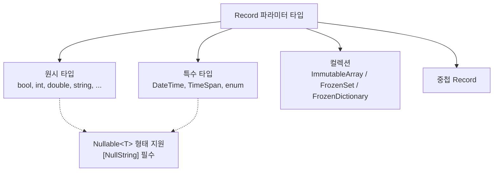

# 4.1 지원 타입 (Schemata)

Sdp는 Record의 파라미터 타입을 정적 분석해, 그 타입이 CSV 셀 값으로 표현 가능한지 검사합니다. 이 장은 **어떤 타입이 허용되는지**, **각 타입에 어떤 Attribute가 강제되는지**, **누락되었을 때 어느 시점에 알 수 있는지** 를 정리합니다.

Attribute 개별 설명은 [4.2 Attribute 카탈로그](./02-attributes.md) 로 미루고, 여기서는 Schemata 관점에서만 다룹니다.

## 한눈에 보기

Sdp가 받는 타입은 네 범주입니다.



## 원시 타입

14종의 원시 타입이 지원됩니다. 각 타입은 대응하는 Nullable 형태(예: `int?`)도 받습니다.

|C# 타입|Nullable|파싱 방식|필수/권장 Attribute|
|-|-|-|-|
|`bool`|O|`bool.TryParse` (대소문자 무시)|—|
|`byte`|O|`byte.TryParse` (InvariantCulture)|`[Range]` 권장|
|`sbyte`|O|`sbyte.TryParse`|`[Range]` 권장|
|`char`|O|단일 문자|—|
|`short`|O|`short.TryParse`|`[Range]` 권장|
|`ushort`|O|`ushort.TryParse`|`[Range]` 권장|
|`int`|O|`int.TryParse`|`[Range]` 권장|
|`uint`|O|`uint.TryParse`|`[Range]` 권장|
|`long`|O|`long.TryParse`|`[Range]` 권장|
|`ulong`|O|`ulong.TryParse`|`[Range]` 권장|
|`float`|O|`float.TryParse`|`[Range]` 권장|
|`double`|O|`double.TryParse`|`[Range]` 권장|
|`decimal`|O|`decimal.TryParse`|`[Range]` 권장|
|`string`|O|원문 그대로|`[RegularExpression]` 권장|

Nullable 인 경우에는 모든 타입에 **`[NullString("...")]` 이 필수** 입니다. 뒤의 [Nullable](#nullable) 절을 참고하세요.

### 누락 감지 시점

- **타입 자체가 미지원** (예: `Guid`, `DateOnly`, `TimeOnly`): Record를 SchemaInfoScanner 로 분석하는 단계 (컴파일 타임에 가까운 Roslyn 분석) 에서 `NotSupportedPrimitiveType` 으로 탈락합니다. `ExcelColumnExtractor` 는 분석 단계에서 중단합니다.
- **파싱 실패** (예: `int` 컬럼에 `"abc"`): `LoadAsync` 런타임에 `InvalidOperationException` 으로 발생합니다.

## 특수 타입: DateTime

|항목|내용|
|-|-|
|지원|O (`DateTime?` 도 지원)|
|파싱 방식|`DateTime.TryParseExact(cell, format, InvariantCulture, None)`|
|강제 Attribute|**`[DateTimeFormat("...")]` 필수**|
|누락 시|`DateTimeFormatAttributeRequired` — SchemaInfoScanner 단계에서 탈락|

포맷 문자열은 .NET 표준 날짜/시간 형식을 따릅니다. 예: `"yyyy-MM-dd"`, `"yyyy-MM-dd HH:mm:ss"`.

## 특수 타입: TimeSpan

|항목|내용|
|-|-|
|지원|O (`TimeSpan?` 도 지원)|
|파싱 방식|`TimeSpan.TryParseExact(cell, format, InvariantCulture)`|
|강제 Attribute|**`[TimeSpanFormat("...")]` 필수**|
|누락 시|`TimeSpanFormatAttributeRequired` — SchemaInfoScanner 단계에서 탈락|

포맷 문자열은 .NET 표준 TimeSpan 형식을 따릅니다. 예: `@"hh\:mm\:ss"`, `@"d\.hh\:mm\:ss"`.

## 특수 타입: enum

|항목|내용|
|-|-|
|지원|O (Nullable enum 도 지원)|
|파싱 방식|**멤버 이름 문자열로 매칭** (숫자 값이 아님)|
|강제 Attribute|없음|
|제약|`[Range]` 사용 불가 (`RangeAttributeCannotBeUsedInEnum`)|
|누락 시|정의되지 않은 멤버 이름은 `LoadAsync` 런타임에 실패|

예를 들어 `enum ItemCategory { Consumable, Weapon, Armor }` 에서 CSV에 `"Consumable"` 이 있어야 `ItemCategory.Consumable` 로 파싱됩니다. `0`, `1`, `2` 로 적으면 실패합니다.

## Nullable

모든 원시 타입과 특수 타입은 Nullable 형태 (`int?`, `DateTime?`, `MyEnum?`) 로 선언할 수 있습니다. **예외 없이 `[NullString("...")]` 이 요구됩니다.**

```csharp
[NullString("NULL")] string? Description
[NullString("")]     int?    Level
```

- CSV 셀 값이 `NullString` 으로 지정한 문자열과 같으면 `null` 로 매핑.
- 다르면 원래 타입으로 파싱.

### 컬렉션 안의 Nullable

원소가 Nullable일 때도 `[NullString]` 이 필요합니다.

|컬렉션 형태|필요한 Attribute|
|-|-|
|`ImmutableArray<int?>`|`[NullString(...)]` — 원소 null 표기|
|`FrozenSet<string?>`|`[NullString(...)]`|
|`FrozenDictionary<int, int?>` (Value nullable)|`[NullString(...)]`|

### 제약

- **컬렉션 자체를 Nullable** 로는 할 수 없습니다. `ImmutableArray<T>?`, `FrozenSet<T>?`, `FrozenDictionary<K,V>?` 는 모두 `NullableCollectionNotSupported` 로 막힙니다. "원소가 없는 상태" 는 빈 컬렉션으로 표현합니다.
- **Nullable Record** (`MyRecord?`) 도 허용되지 않습니다.
- Dictionary의 Key는 Nullable 불가 (`DictionaryKeyMustBeNonNullable`).

## 컬렉션

세 가지 컬렉션 타입이 지원됩니다.

|타입|원소 허용|크기 지정 Attribute|
|-|-|-|
|`ImmutableArray<T>`|원시 / Record|`[Length(n)]` **또는** `[SingleColumnCollection(...)]`|
|`FrozenSet<T>`|원시 / Record|`[Length(n)]` **또는** `[SingleColumnCollection(...)]`|
|`FrozenDictionary<K, V>`|원시 / Record|`[Length(n)]`|

### `[Length(n)]` 방식

Excel 헤더가 `Name[0]`, `Name[1]`, ..., `Name[n-1]` 과 같이 펼쳐집니다. 고정 크기.

### `[SingleColumnCollection(sep)]` 방식

하나의 셀에 `"a,b,c"` 처럼 구분자로 여러 값을 몰아 넣습니다. `[Length]` 와 상호 배타적이며, 같이 쓰면 `CountRangeAndLengthMutuallyExclusive` 오류. 길이 제약은 `[CountRange(min, max)]` 로 줍니다.

### Dictionary 규칙

- Key와 Value 모두 non-nullable.
- Value 가 Record 인 경우, 그 Record에 `[Key]` 가 있는 파라미터가 **정확히 하나** 있어야 함 (`ValueRecordMustHaveOneKeyMember`).
- Key 타입과 Value Record의 `[Key]` 파라미터 타입이 **일치** 해야 함.

### 지원되지 않는 컬렉션

`T[]`, `List<T>`, `IEnumerable<T>`, 일반 `Dictionary<K,V>` 등 표준 수정 가능 컬렉션은 불가능합니다. 불변성을 위한 의도적인 제약입니다. SchemaInfoScanner 단계에서 `NotSupportedCollectionType` 으로 걸립니다.

## 중첩 Record

Record의 파라미터가 또 다른 Record 일 수 있습니다. 이때 내부 Record의 모든 파라미터는 이 문서에서 설명한 규칙을 재귀적으로 따릅니다.

```csharp
public sealed record Position(int X, int Y);

[StaticDataRecord("Spawn", "Spawns")]
public sealed record SpawnPoint(
    [Key] int Id,
    Position Point);
```

Excel 헤더는 `Id`, `Point.X`, `Point.Y` 로 펼쳐집니다. [표준 헤더 생성기](../03-usage/04-header-generator.md) 로 자동 조립이 가능합니다.

중첩 Record는 순환 참조도 감지합니다. 파생이 되돌아오는 구조는 거부합니다.

## 지원되지 않는 타입 정리

자주 시도되지만 지원하지 않는 타입을 모아 둡니다.

|타입|감지 시점|오류 식별자|
|-|-|-|
|`Guid`|SchemaInfoScanner|`NotSupportedPrimitiveType`|
|`DateOnly`|SchemaInfoScanner|`NotSupportedPrimitiveType`|
|`TimeOnly`|SchemaInfoScanner|`NotSupportedPrimitiveType`|
|`T[]`|SchemaInfoScanner|`NotSupportedCollectionType`|
|`List<T>`|SchemaInfoScanner|`NotSupportedCollectionType`|
|`Dictionary<K, V>` (일반)|SchemaInfoScanner|`NotSupportedCollectionType`|
|`ImmutableArray<T>?`|SchemaInfoScanner|`NullableCollectionNotSupported`|
|`Record?`|SchemaInfoScanner|`NullableCollectionNotSupported`|
|Nullable 타입에 `[NullString]` 없음|SchemaInfoScanner|`NullStringAttributeRequiredForNullable`|
|`DateTime` 에 `[DateTimeFormat]` 없음|SchemaInfoScanner|`DateTimeFormatAttributeRequired`|
|`TimeSpan` 에 `[TimeSpanFormat]` 없음|SchemaInfoScanner|`TimeSpanFormatAttributeRequired`|
|컬렉션에 `[Length]`, `[SingleColumnCollection]` 둘 다 없음|SchemaInfoScanner|`LengthAttributeRequired`|
|`int` 컬럼에 `"abc"` 같은 비숫자 값|`LoadAsync` 런타임|`InvalidOperationException`|
|enum 컬럼에 미정의 멤버 이름|`LoadAsync` 런타임|`InvalidOperationException`|

각 Attribute 별로 어느 단계에서 오류가 드러나는지는 [4.2 Attribute 카탈로그](./02-attributes.md) 의 "검증 시점" 컬럼에 정리되어 있습니다.

---

[← 이전: 3.6 StaticDataManager로 여러 테이블 관리](../03-usage/06-static-data-manager.md) | [목차](../README.md) | [다음: 4.2 Attribute 카탈로그 →](./02-attributes.md)
