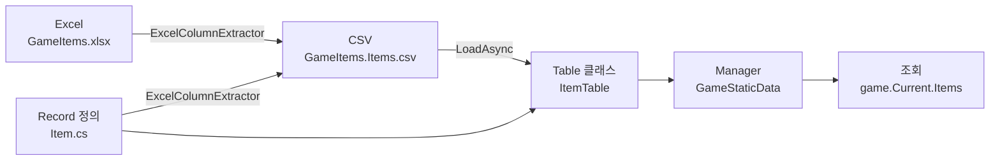

# 빠른 시작

Sdp 의 가장 기본적인 흐름 — **Record 정의 → Table 정의 → Manager 로 로드 → 조회** — 을 한 페이지로 끝냅니다. FK 와 뷰는 다루지 않습니다 (각 항목은 [상세 사용법](./README.md) 참고).

이 문서를 따라 끝내고 나면 다음을 갖추게 됩니다.

- 한 시트짜리 정적 데이터를 메모리에 적재한 매니저 인스턴스
- ID 로 한 행을 조회할 수 있는 인덱스
- 추가 시트가 생기면 늘려 갈 수 있는 골격

설치는 [2. 설치](./02-installation.md) 를 따라 끝내 두었다고 가정합니다.

## 전체 흐름



Record 와 Excel 양쪽을 입력으로 받아 CSV 가 추출되고, 그 CSV 가 매니저의 `LoadAsync` 를 통해 테이블로 적재됩니다. 조회는 매니저의 `Current` 스냅샷에서 시작합니다.

## 1. Record 정의

한 행의 모양과 어느 시트에서 오는지를 record + Attribute 로 적습니다.

```csharp
using Sdp.Attributes;

public enum ItemCategory
{
    Consumable,
    Weapon,
    Armor,
}

[StaticDataRecord("GameItems", "Items")]
public sealed record Item(
    int Id,
    string Name,
    int Price,
    ItemCategory Category);
```

- `[StaticDataRecord("GameItems", "Items")]` — 첫 인자는 Excel 파일 이름 (확장자 제외), 두 번째 인자는 시트 이름. 파일과 시트 이름은 달라도 됩니다. 추출된 CSV 는 `{파일}.{시트}.csv` 규칙을 따라 `GameItems.Items.csv` 가 됩니다.
- 파라미터 이름이 곧 헤더 이름. enum 은 문자열로 매칭됩니다.

## 2. Table 정의

`StaticDataTable<TSelf, TRecord>` 를 상속하고 `ImmutableList<TRecord>` 한 개짜리 생성자를 제공합니다. 단건 조회용 `UniqueIndex` 도 같이 둡니다.

```csharp
using System.Collections.Immutable;
using Sdp.Table;

public sealed class ItemTable : StaticDataTable<ItemTable, Item>
{
    private readonly UniqueIndex<Item, int> byId;

    public ItemTable(ImmutableList<Item> records)
        : base(records)
    {
        byId = new UniqueIndex<Item, int>(records, x => x.Id);
    }

    public Item Get(int id) => byId.Get(id);

    public bool TryGet(int id, out Item? record) => byId.TryGet(id, out record);
}
```

`Records` 속성으로 전체 목록도 그대로 노출되며, **CSV 의 행 순서를 그대로 유지** 합니다. 정렬이 필요하면 Excel/CSV 측에서 의도한 순서로 정렬해 두면 됩니다.

## 3. Manager 와 TableSet

Manager 는 "어떤 테이블들을 다루는지" 를 TableSet record 로 받습니다. TableSet 은 Manager 안쪽에 같이 두는 것을 권장합니다.

```csharp
using Microsoft.Extensions.Logging;
using Sdp.Manager;

public sealed class GameStaticData(ILogger<GameStaticData> logger)
    : StaticDataManager<GameStaticData.TableSet>(logger)
{
    public sealed record TableSet(ItemTable? Items);
}
```

- TableSet 의 각 테이블은 nullable. 로드 옵션으로 일부를 건너뛸 수 있기 때문입니다 ([3.5](./03-usage/05-static-data-manager.md)).
- **외부 노출은 `Current` 한 곳만 한다.** 호출부에서는 `game.Current` 로 한 번 받아 두고 그 안에서 각 테이블을 꺼내 씁니다. 매니저에서 `Items => Current.Items!` 처럼 테이블을 풀어 두지 않는 이유는, 같은 작업 안에서 두 번의 `Current.X` 가 서로 다른 스냅샷을 보게 될 수 있기 때문입니다. 한 번에 받아 두면 그 스냅샷이 작업 끝까지 고정됩니다.

## 4. CSV 준비

`GameItems.Items.csv` 를 만들어 CSV 디렉터리에 둡니다 (실제로는 [3.1](./03-usage/01-record-to-excel.md), [3.2](./03-usage/02-header-generator.md) 흐름으로 Excel → CSV 가 자동화됩니다).

```
Id,Name,Price,Category
1,Potion,100,Consumable
2,Sword,5000,Weapon
3,Shield,4000,Armor
```

## 5. 로드와 조회

```csharp
var game = new GameStaticData(logger);
await game.LoadAsync("./csv");

var snapshot = game.Current;
var sword = snapshot.Items!.Get(2);
Console.WriteLine($"{sword.Name}: {sword.Price}");
```

`LoadAsync` 는 CSV 디렉터리를 통째로 받아 TableSet 의 모든 테이블을 병렬 로드하고, FK 가 있다면 검증까지 끝낸 뒤 `Current` 에 한 번에 교체합니다. 다시 호출하면 새 스냅샷으로 atomic swap. 동시 조회 안전.

```csharp
// 두 테이블을 같은 스냅샷에서 꺼내 쓰고 싶다면 — 한 번만 받는다
var snapshot = game.Current;
foreach (var item in snapshot.Items!.Records)
{
    Console.WriteLine($"{item.Id} {item.Name}");
}
```

## 다음 단계

여기서 익힌 5단계가 Sdp 사용의 80 % 입니다. 나머지는 필요할 때 골라 보면 됩니다.

- 한 컬럼에 여러 값, 날짜, 객체 배열 — [4.1 지원 타입](./04-advanced/01-schemata.md)
- 여러 테이블 묶어 로드 — [3.5 StaticDataManager](./03-usage/05-static-data-manager.md)
- 테이블 사이의 외래 키 검증 — [3.6 외래 키](./03-usage/06-foreign-keys.md)
- 테이블 위에서 사전 생성되는 read-only 합성 결과 — [3.7 StaticDataView](./03-usage/07-static-data-view.md)
- Excel 을 코드 없이 시작하려면 — [3.1 Record 를 먼저 쓰고 Excel 작업하기](./03-usage/01-record-to-excel.md), [3.2 표준 헤더 생성기](./03-usage/02-header-generator.md)
- 사용 가능한 타입과 Attribute 의 전체 목록 — [4.1 지원 타입](./04-advanced/01-schemata.md), [4.2 Attribute 카탈로그](./04-advanced/02-attributes.md)

---

[목차](./README.md)
