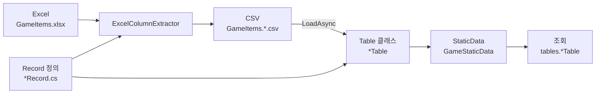

# 빠른 시작

Sdp 의 가장 기본적인 흐름 — **Record 정의 → Table 정의 → Manager 로 로드 → 조회** — 을 한 페이지로 끝냅니다. FK 와 뷰는 다루지 않습니다 (각 항목은 [상세 사용법](./README.md) 참고).

이 문서를 따라 끝내고 나면 다음을 갖추게 됩니다.

- 여러 시트를 한 번에 적재한 StaticDataManager 인스턴스
- ID 로 한 행을 조회할 수 있는 인덱스
- 추가 시트가 생기면 늘려 갈 수 있는 골격

설치는 [2. 설치](./02-installation.md) 를 따라 끝내 두었다고 가정합니다.

## 전체 흐름


```mermaid
flowchart LR
    Excel["Excel<br/>GameItems.xlsx"]
    Record["Record 정의<br/>*Record.cs"]
    Extractor["ExcelColumnExtractor"]
    Csv["CSV<br/>GameItems.*.csv"]
    Table["Table 클래스<br/>*Table"]
    Manager["StaticData<br/>GameStaticData"]
    App["조회<br/>tables.*Table"]

    Excel --> Extractor
    Record --> Extractor
    Extractor --> Csv
    Csv --> |LoadAsync| Table
    Record --> Table
    Table --> Manager
    Manager --> App
```

`ExcelColumnExtractor` 가 Record 와 Excel 양쪽을 입력으로 받아 CSV 를 추출하고, 그 CSV 가 StaticDataManager 의 `LoadAsync` 를 통해 테이블로 적재됩니다. 조회는 StaticDataManager 의 `Current` 스냅샷에서 시작합니다.

</br></br></br>

## 1. Record 정의

한 행의 모양과 어느 시트에서 오는지를 record + Attribute 로 적습니다.

```csharp
using Sdp.Attributes;

public enum ItemCategory
{
    Consumable,
    Weapon,
    Armor,
}

[StaticDataRecord("GameItems", "Items")]
public sealed record ItemRecord(
    int Id,
    string Name,
    [Range(0, 1_000_000)] int Price,
    ItemCategory Category);

[StaticDataRecord("GameItems", "Heroes")]
public sealed record HeroRecord(
    int Id,
    string Name,
    int Level);

[StaticDataRecord("GameItems", "Quests")]
public sealed record QuestRecord(
    int Id,
    [RegularExpression(@"^.{1,50}$")] string Title,
    int RewardItemId);
```

- `[StaticDataRecord("파일", "시트")]` — 첫 인자는 Excel 파일 이름 (확장자 제외), 두 번째 인자는 시트 이름. 파일과 시트 이름은 달라도 됩니다. 추출된 CSV 는 `{파일}.{시트}.csv` 규칙을 따라 `GameItems.Items.csv` 가 됩니다.
- 파라미터 이름이 곧 헤더 이름. enum 은 문자열로 매칭됩니다.
- `[Range(0, 1_000_000)]` — `Price` 값이 0 ~ 1,000,000 범위 안인지 검사합니다. 선언만 해 두면 추출 단계와 런타임 로드 양쪽에서 자동으로 검증되어, 범위를 벗어난 값은 별도 코드 없이 걸러집니다.
- `[RegularExpression(@"^.{1,50}$")]` — `Title` 이 1 ~ 50 자인지 정규식으로 검사합니다. 이 역시 선언만으로 추출과 로드 양쪽에서 검증됩니다.

</br></br></br>

## 2. Table 정의

`StaticDataTable<TRecord>` 를 상속하고 `ImmutableArray<TRecord>` 한 개짜리 생성자를 제공합니다. 키로 단일 레코드를 찾을 수 있도록 `UniqueIndex` 도 같이 둡니다.

```csharp
using System.Collections.Immutable;
using Sdp.Table;

public sealed class ItemTable : StaticDataTable<ItemRecord>
{
    private readonly UniqueIndex<ItemRecord, int> byId;

    public ItemTable(ImmutableArray<ItemRecord> records)
        : base(records)
    {
        byId = new UniqueIndex<ItemRecord, int>(records, x => x.Id);
    }

    public ItemRecord Get(int id) => byId.Get(id);

    public bool TryGet(int id, out ItemRecord? record) => byId.TryGet(id, out record);
}

public sealed class HeroTable(ImmutableArray<HeroRecord> records)
    : StaticDataTable<HeroRecord>(records);

public sealed class QuestTable(ImmutableArray<QuestRecord> records)
    : StaticDataTable<QuestRecord>(records);
```

`ItemTable` 처럼 `UniqueIndex` 를 둔 테이블만이 아니라, `HeroTable` · `QuestTable` 같이 인덱스 없는 테이블도 `Records` 속성으로 전체 목록을 그대로 노출합니다. `Records` 는 CSV 에 입력된 행 순서를 유지합니다.

</br></br></br>

## 3. Manager 와 TableSet

Manager 는 "어떤 테이블들을 다루는지" 를 TableSet record 로 받습니다. TableSet 의 각 파라미터는 테이블 클래스의 인스턴스입니다.

```csharp
using Microsoft.Extensions.Logging;
using Sdp.Manager;

public sealed class GameStaticData(ILogger<GameStaticData> logger)
    : StaticDataManager<GameStaticData.TableSet>(logger)
{
    public sealed record TableSet(
        ItemTable? ItemTable,
        HeroTable? HeroTable,
        QuestTable? QuestTable);
}
```

- TableSet 의 각 테이블은 nullable. 로드 옵션으로 일부를 건너뛸 수 있기 때문입니다 ([3.5](./03-usage/05-static-data-manager.md)).
- **외부 노출은 `Current` 한 곳만 한다.** 호출부에서는 `staticData.Current` 로 한 번 받아 두고 그 안에서 각 테이블을 꺼내 씁니다. StaticDataManager 에서 `ItemTable => Current.ItemTable!` 처럼 테이블을 풀어 두지 않는 이유는, 같은 작업 안에서 두 번의 `Current.X` 가 서로 다른 스냅샷을 보게 될 수 있기 때문입니다. 한 번에 받아 두면 그 스냅샷이 작업 끝까지 고정됩니다.

</br></br></br>

## 4. CSV 준비

`GameItems.Items.csv` 등 시트별 CSV 를 CSV 디렉터리에 둡니다 (실제로는 [3.1](./03-usage/01-record-to-excel.md), [3.2](./03-usage/02-header-generator.md) 흐름으로 Excel → CSV 가 자동화됩니다).

```
Id,Name,Price,Category
1,Potion,100,Consumable
2,Sword,5000,Weapon
3,Shield,4000,Armor
```

</br></br></br>

## 5. 로드와 조회

```csharp
var staticData = new GameStaticData(logger);
await staticData.LoadAsync("./csv");

var tables = staticData.Current;
var sword = tables.ItemTable!.Get(2);
Console.WriteLine($"{sword.Name}: {sword.Price}");
```

`LoadAsync` 는 CSV 디렉터리를 통째로 받아 TableSet 의 모든 테이블을 병렬 로드하고, FK 가 있다면 검증까지 끝낸 뒤 `Current` 에 한 번에 교체합니다. 다시 호출하면 새 스냅샷으로 atomic swap. 동시 조회 안전.

```csharp
// LoadAsync 가 백그라운드에서 실행될 수 있는 환경이라면 Current 를 변수에 받아 두고 사용한다
var tables = staticData.Current;
foreach (var quest in tables.QuestTable!.Records)
{
    Console.WriteLine($"{quest.Id} {quest.Title}");
}
```

</br></br></br>

## 다음 단계

여기서 익힌 5단계가 Sdp 사용의 80 % 입니다. 다음 두 챕터 중 한쪽으로 이어 가면 자연스럽습니다.

- 이미 Excel 시트가 있고 거기에 맞춰 Record 를 짜야 한다면 — [3.1 Excel 작업하기](./03-usage/01-record-to-excel.md)
- 빈 상태에서 Record 부터 시작해 Excel 까지 짜야 한다면 — [3.3 첫 Record 정의하기](./03-usage/03-first-record.md)

---

[목차](./README.md)
