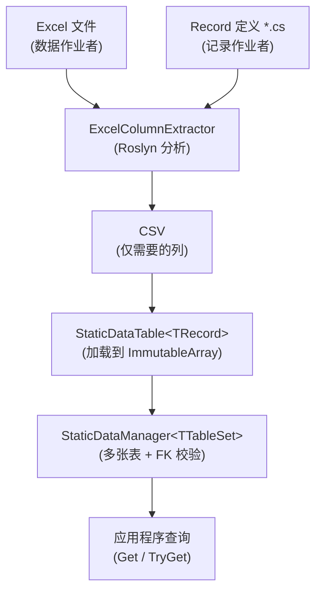

# 1. 简介

## Sdp 简介

**StaticDataPipeline (Sdp)** 是一个流水线库，它将定义在 Excel 中的静态数据加载为 C# Record，并把经过校验的不可变集合放到内存中以供高速查询。

它适合"加载一次、之后只读"的数据，例如游戏服务器、客户端以及仿真工具中的数据。

   

## 主要优点

#### Excel 工作与代码工作的并行化
从数据结构达成一致的那一刻起，数据作业者与记录作业者就可以互不等待、各自独立推进。

 

#### 声明式架构定义
类型、列、外键关系都直接用 C# Record 和 Attribute 声明。无需单独的映射代码，仅凭声明即可加载到强类型对象中。

 

#### 前置校验
外键完整性、null 表示处理、必需 Attribute 缺失等检查会在构建阶段和加载阶段自动执行。可以减少错误数据流向生产环境的情况。

 

#### 类型品牌化支持
通过单参数 record 或 enum，可以将含义不同的 ID 当作各自独立的类型来对待。错误的 ID 赋值会在构建阶段暴露，而在 Excel 工作表中它们仍显示为普通的一列（详情参阅 [5.3](./05-advanced/03-type-branding.md)）。

 

#### 保证已加载数据的不可变性
Record 是不可变的，集合也加载到 `ImmutableArray`、`FrozenSet`、`FrozenDictionary` 这类不可变类型中。加载后数据可能被意外更改的路径本身就被堵死了。

   

## 数据流

   

## 如果你只想先跑一次看看

最快的途径是把[快速开始](./quickstart.md)这一页从头跟到尾。它只涉及 Record → Table → Manager → 加载 → 查询的骨架，略去了 FK 和视图，因此 5 分钟即可完成。正式的使用之后从 [3.1](./03-usage/01-record-to-excel.md) 开始跟进即可。

---

[目录](./README.md) | [下一篇: 2. 安装 →](./02-installation.md)
