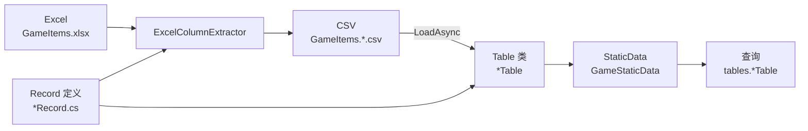

# 快速开始

本页用一页讲完 Sdp 最基本的流程 —— **定义 Record → 定义 Table → 用 Manager 加载 → 查询**。不涉及 FK 和视图（各主题请参阅[详细使用指南](./README.md)）。

跟着本文档走到最后，你将拥有：

- 一次性加载了多张工作表的 StaticDataManager 实例
- 可以按 ID 查询单行的索引
- 一个可随工作表增加而扩展的骨架

本文假定你已按照 [2. 安装](./02-installation.md) 完成了安装。

## 整体流程



`ExcelColumnExtractor` 同时以 Record 和 Excel 文件作为输入并提取出 CSV，该 CSV 再通过 StaticDataManager 的 `LoadAsync` 加载到表中。查询从 StaticDataManager 的 `Current` 快照开始。

</br></br></br>

## 1. 定义 Record

用 record + Attribute 来描述一行的形态以及它来自哪张工作表。

```csharp
using Sdp.Attributes;

public enum ItemCategory
{
    Consumable,
    Weapon,
    Armor,
}

[StaticDataRecord("GameItems", "Items")]
public sealed record ItemRecord(
    int Id,
    string Name,
    [Range(0, 1_000_000)] int Price,
    ItemCategory Category);

[StaticDataRecord("GameItems", "Heroes")]
public sealed record HeroRecord(
    int Id,
    string Name,
    int Level);

[StaticDataRecord("GameItems", "Quests")]
public sealed record QuestRecord(
    int Id,
    [RegularExpression(@"^.{1,50}$")] string Title,
    int RewardItemId);
```

- `[StaticDataRecord("文件", "工作表")]` —— 第一个参数是 Excel 文件名（不含扩展名），第二个参数是工作表名。文件名和工作表名可以不同。提取出的 CSV 遵循 `{文件}.{工作表}.csv` 的约定，最终为 `GameItems.Items.csv`。
- 参数名即为表头名。enum 按字符串进行匹配。
- `[Range(0, 1_000_000)]` —— 检查 `Price` 的值是否在 0 至 1,000,000 范围内。只需声明，即可在提取阶段和运行时加载两端自动验证，超出范围的值无需额外代码即被过滤掉。
- `[RegularExpression(@"^.{1,50}$")]` —— 用正则表达式检查 `Title` 是否为 1 至 50 个字符。这同样只需声明即可在提取和加载两端验证。

</br></br></br>

## 2. 定义 Table

继承 `StaticDataTable<TRecord>`，并提供一个接收单个 `ImmutableArray<TRecord>` 的构造函数。同时放置一个 `UniqueIndex`，以便按键查找单条记录。

```csharp
using System.Collections.Immutable;
using Sdp.Table;

public sealed class ItemTable : StaticDataTable<ItemRecord>
{
    private readonly UniqueIndex<ItemRecord, int> byId;

    public ItemTable(ImmutableArray<ItemRecord> records)
        : base(records)
    {
        byId = new UniqueIndex<ItemRecord, int>(records, x => x.Id);
    }

    public ItemRecord Get(int id) => byId.Get(id);

    public bool TryGet(int id, out ItemRecord? record) => byId.TryGet(id, out record);
}

public sealed class HeroTable(ImmutableArray<HeroRecord> records)
    : StaticDataTable<HeroRecord>(records);

public sealed class QuestTable(ImmutableArray<QuestRecord> records)
    : StaticDataTable<QuestRecord>(records);
```

不仅是像 `ItemTable` 这样放置了 `UniqueIndex` 的表，连 `HeroTable`、`QuestTable` 这类没有索引的表也通过 `Records` 属性直接公开完整列表。`Records` 保持 CSV 中输入的行顺序。

</br></br></br>

## 3. Manager 与 TableSet

Manager 通过 TableSet record 接收"它处理哪些表"。TableSet 的每个参数都是某个表类的实例。

```csharp
using Microsoft.Extensions.Logging;
using Sdp.Manager;

public sealed class GameStaticData(ILogger<GameStaticData> logger)
    : StaticDataManager<GameStaticData.TableSet>(logger)
{
    public sealed record TableSet(
        ItemTable? ItemTable,
        HeroTable? HeroTable,
        QuestTable? QuestTable);
}
```

- TableSet 中的每个表都是 nullable。这是因为加载选项可以跳过其中一部分（[3.5](./03-usage/05-static-data-manager.md)）。
- **对外只通过 `Current` 一处公开。** 在调用方先用 `staticData.Current` 接收一次，然后从中取出各个表使用。StaticDataManager 之所以不像 `ItemTable => Current.ItemTable!` 这样把表展开，是因为同一操作中两次 `Current.X` 访问可能会看到不同的快照。接收一次就能将该快照固定到操作结束。

</br></br></br>

## 4. 准备 CSV

将 `GameItems.Items.csv` 等按工作表划分的 CSV 放到 CSV 目录中（实际上，Excel → CSV 这一步通过 [3.1](./03-usage/01-record-to-excel.md)、[3.2](./03-usage/02-header-generator.md) 的流程实现自动化）。

```
Id,Name,Price,Category
1,Potion,100,Consumable
2,Sword,5000,Weapon
3,Shield,4000,Armor
```

</br></br></br>

## 5. 加载与查询

```csharp
var staticData = new GameStaticData(logger);
await staticData.LoadAsync("./csv");

var tables = staticData.Current;
var sword = tables.ItemTable!.Get(2);
Console.WriteLine($"{sword.Name}: {sword.Price}");
```

`LoadAsync` 接收整个 CSV 目录，并行加载 TableSet 的所有表，若存在 FK 则在完成验证后一次性替换 `Current`。再次调用会以原子方式（atomic swap）切换到新快照。并发查询是安全的。

```csharp
// 若 LoadAsync 可能在后台运行，则先将 Current 接收到变量再使用
var tables = staticData.Current;
foreach (var quest in tables.QuestTable!.Records)
{
    Console.WriteLine($"{quest.Id} {quest.Title}");
}
```

</br></br></br>

## 下一步

你在这里学到的 5 个步骤就是使用 Sdp 的 80 %。接着进入下面两章之一会很自然。

- 如果你已经有了 Excel 工作表，需要照着它编写 Record —— [3.1 处理 Excel](./03-usage/01-record-to-excel.md)
- 如果你要从零开始，以 Record 为起点一直写到 Excel —— [3.3 定义你的第一个 Record](./03-usage/03-first-record.md)

---

[目录](./README.md)
